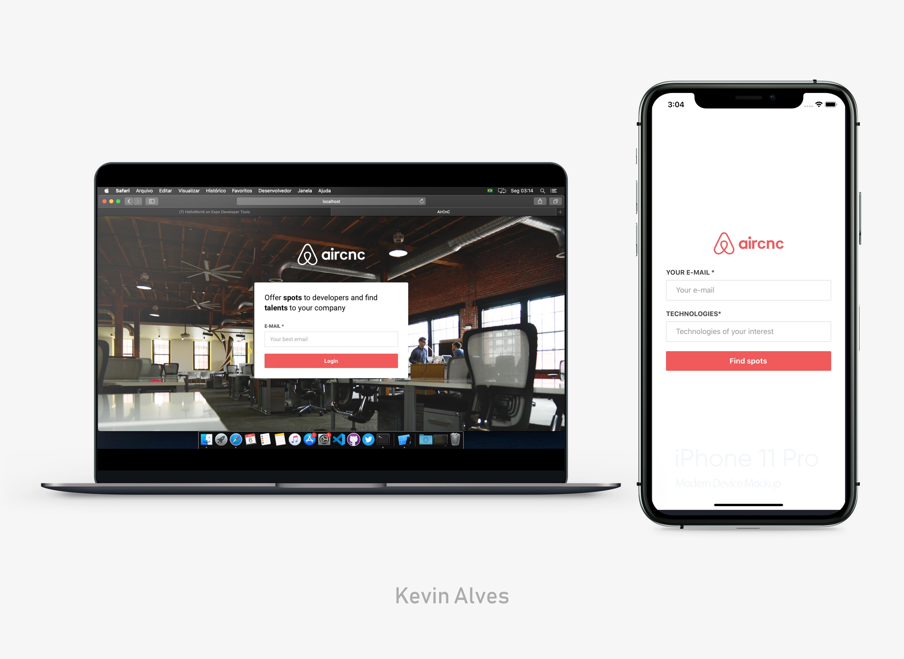

<h1 align="center">
    
</h1>
<h3 align="center">AirCnC Fullstack project</h3>

<h4 align="center">
  🛸 Stay hungry, stay foolish
</h4>

<div align="center">
    
[]()
[](https://github.com/kevdeveloper/fullstackproject-aircnc/commits/master)
[](/LICENSE)
[](/LICENSE)
[](https://github.com/kevdeveloper)
[](https://twitter.com/kevinfrontend)
</div>

<p align="center">
<a href="#about">About</a>&nbsp;&nbsp;&nbsp;|&nbsp;&nbsp;&nbsp;
<a href="#installing">Installing</a>&nbsp;&nbsp;&nbsp;|&nbsp;&nbsp;&nbsp;
<a href="#built_using">Built with</a>&nbsp;&nbsp;&nbsp;|&nbsp;&nbsp;&nbsp;
<a href="#author">Author</a>
</p>

<p align="center">
  <a href="" rel="noopener">
  
  </a>
</p>

## 🧐 About <a name = "about"></a>
<h3 align="center"> AirCnC is a Fullstack project, inclusing a beckend built in node.js, a website built in React.JS and a mobile app built with React Native. It aims to connect companies that want to open spots and developers looking for a place to exchange ideas with devs, get to know the company and work there for a period.</h3>


## 🔧 Built with<a name = "built_using"></a>

- [Node.js](https://nodejs.org/en/) - a JavaScript runtime built on Chrome's V8 JavaScript engine.
- [React](https://reactjs.org/) - A JavaScript library for building user interfaces
- [React Native](https://reactnative.dev/) - A framework for building native apps with React
- [MongoDB](https://www.mongodb.com/) -  The most popular database for modern apps;
- [Expo](https://expo.io/) -  an open-source platform for making universal native apps for Android, iOS, and the web with JavaScript and React.
- [Nodemon](https://nodemon.io/) - a utility that will monitor for any changes in your source and automatically restart your server;
- [SOCKET.IO](https://socket.io/) - THE FASTEST AND MOST RELIABLE REAL-TIME ENGINE;
- [Axios](https://github.com/axios/axios) -  Promise based HTTP client for the browser and node.js ;
- [Insomnia](https://insomnia.rest/) - a free cross-platform desktop application that takes the pain out of interacting with HTTP-based APIs;
- [PhotoShop CC](https://adobe.com/) - The most powerfull photo editor ever made;

### 🛠 Installing <a name = "installing"></a>

```
- fork this repository
- clone it 
- npm install whenever necessary
- yarn dev/yarn start

***in order to see the backend working, you have to create an acc at mongoDB and add your login:pass at server.js

```
## ✒️  Autor <a name = "author"></a>

👤 **Kevin Alves**

- Github: [@kevdeveloper](https://github.com/kevdeveloper)
- Twitter: [@kevinfrontend](https://twitter.com/kevinfrontend)
- Linkedin: [@kevinfrontend](https://www.linkedin.com/in/kevinnn/)

## 🤝 Contributing

Contributions, issues and feature requests are welcome!

Feel free to check the [issues page](https://github.com/kevdeveloper/fullstackproject-aircnc/issues).


## 👍 Show your support

Give a ⭐️ if you like this project!


## 📝 License

This project is free to use as learning purposes. For any external content (e.g. logo, images, ...), please contact the proper author and check their license of use.

<small>Template made by <a href='https://twitter.com/kevinfrontend'>Kevin Alves</a></small>
